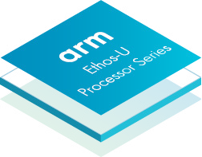

# Arm Ethos-U Processor Series

Arm Ethos-U NPUs are AI accelerators designed for efficient and scalable machine learning on embedded devices, supporting a range of Arm Cortex and Neoverse processors.


{}
- **Performance Range:** Scales from GOP/s to TOP/s to meet various ML performance requirements.
- **Integration:** Compatible with both high-performance Cortex-A and low-power Cortex-M embedded systems.
- **Architecture:** Includes integrated DMA, MAC array, and element-wise engines.
- **Energy Efficiency:** Reduces energy consumption for ML workloads (e.g., ASR) by up to 90% compared to previous Cortex-M generations.
- **Network Support:** Supports neural networks including CNNs and RNNs for audio processing, speech recognition, image classification, and object detection.
- **Operator Coverage:** Executes heavy compute operators directly on the NPU (convolution, transformer, LSTM, RNN, pooling, activation functions, and primitive element-wise functions). Fallback kernels run on the tightly coupled Cortex-M (via CMSIS-NN) or Cortex-A (via Arm Compute Library).
- **Memory Optimization:** Model compression reduces memory footprint by up to 70%. Offline compilation (operator/layer fusion and layer reordering) can further reduce system memory requirements by up to 90%.
- **Toolchain:** Uses a unified toolchain across Arm Cortex and Ethos-U processors.
{}

{}
- Object classification
- Object detection
- Face detection/identification
- Human pose estimation
- Image segmentation
- Image beautification
- Super resolution
- Speech recognition
- Sound recognition
- Noise cancellation
- Speech synthesis
- Language translation
- Natural language processing
{}


## Specifications

### Ethos-U55

| Feature | Specification |
| :--- | :--- |
| **Performance (At 1 GHz)** | 64 to 512 GOP/s |
| **MACs (8x8)** | 32, 64, 128, 256 |
| **Internal SRAM** | 18 to 50 KB |
| **System Interfaces** | Two 64-bit AXI |
| **External Memory** | SRAM and Flash |
| **Recommended Host CPU** | Cortex-M55, Cortex-M7, Cortex-M4, Cortex-M33 |
| **Operating Systems** | Bare-metal or RTOS |

### Ethos-U65

| Feature | Specification |
| :--- | :--- |
| **Performance (At 1 GHz)** | 512 GOP/s to 1 TOP/s |
| **MACs (8x8)** | 256, 512 |
| **Internal SRAM** | 55 to 104 KB |
| **System Interfaces** | Two 128-bit AXI |
| **External Memory** | SRAM, DRAM, and/or FLASH |
| **Recommended Host CPU** | Cortex-M55, Cortex-M7 |
| **Operating Systems** | Bare-metal, RTOS, or Linux |

### Ethos-U85

| Feature | Specification |
| :--- | :--- |
| **Performance (At 1 GHz)** | 256 GOPS/s to 4 TOP/s |
| **MACs (8x8)** | 128, 256, 512, 1024, 2048 |
| **Internal SRAM** | 29 to 267 KB |
| **System Interfaces** | Up to six 128-bit AMBA 5 AXI |
| **External Memory** | SRAM, DRAM and/or FLASH |
| **Recommended Host CPU** | Cortex-M85, Cortex-M55, Cortex-M7, Cortex-A520, Cortex-A510, Cortex-A57, Cortex-A55, Cortex-A53, Cortex-A35 |
| **Operating Systems** | RTOS, Bare-metal, or Linux |

## Resources

- [Arm Ethos-U Developer Page](https://developer.arm.com/ethos-u)
