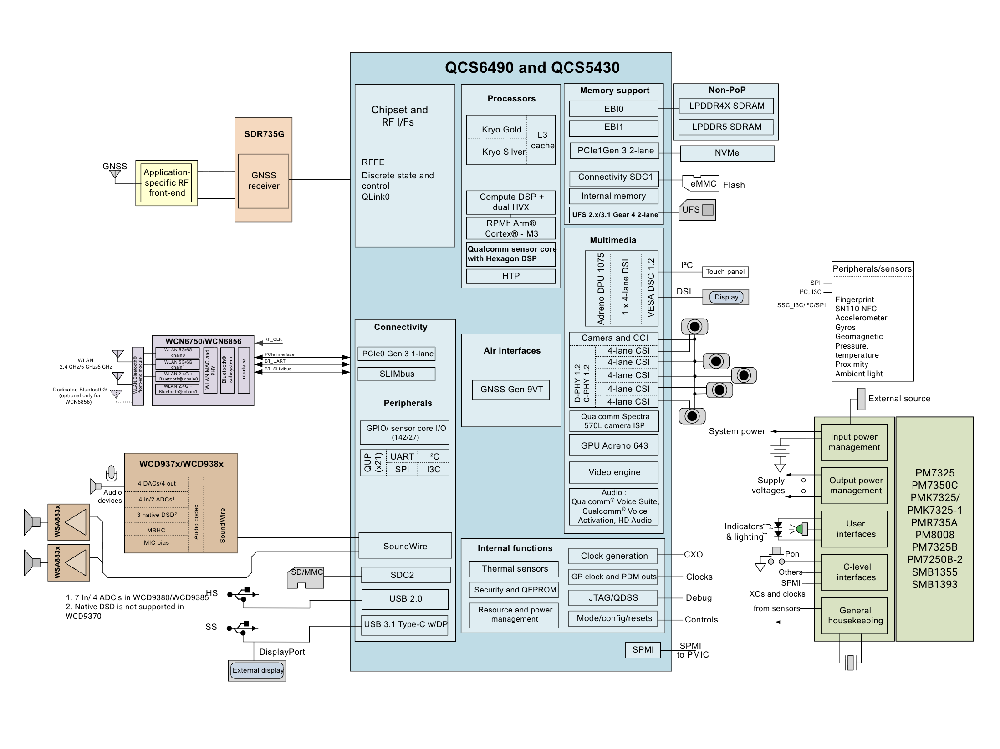

# QCS6490 / QCM6490

## General Specifications
{}

| **SoC** | **QCS6490 / QCM6490**                                                                                                           |
|---------|----------------------------------------------------------------------------------------------------------------------------------|
| **CPU** | 1x Kryo Gold plus (A78): high-performance core up to 2.7 GHz 3x Kryo Gold (A78): high-performance cores @ 2.4 GHz 4x Kryo Silver (A55): low-power cores @ 1.9 GHz - Designed with the 6 nm process |
| **RAM** | Dual-channel non-PoP high-speed memory, LPDDR5/LPDDR4x SDRAM - LPDDR5 SDRAM designed for 3200 MHz clock (2 x 16-bit) - LPDDR4X SDRAM designed for 2133 MHz clock (2 x 16-bit) |
| **GPU** | Adreno 643 GPU @ 812 MHz            |
| **VPU** | - 4K@60fps decode for H.264/H.265/VP9 - 4K@30fps encode for H.264/H.265                |
| **NPU** | 6th gen Qualcomm® AI Engine: - Compute Hexagon DSP with dual Hexagon Vector eXtensions (HVX) - Hexagon Co-processor (Hexagon CP) 2.0 - Hexagon Tensor Accelerator                                                                |

{}
 
{}

{}

### Also known as:

- SC7280
- QCS6490
- QCM6490

---

## Resources:

- [QCS6490 / QCM6490 Product brief PDF](assets/qcs-qcm6490-product-brief_87-28733-1.pdf)
- [QCS6490 and QCS5430 Data Sheet](https://docs.qualcomm.com/bundle/publicresource/topics/80-23889-1/device-description.html)
- [AArch64 SoC Features](https://github.com/hrw/arm-socs-table/blob/main/cpuinfo-data/qcs6490)

---

## Linux Support

### Mainline kernel
- [x] Fully supported. Driver Support Matrix available [here](https://linux-msm.github.io/mainline-status/soc/kodiak)

### Mesa GPU support
- [x] Available with [Freedreno](https://docs.mesa3d.org/drivers/freedreno.html) (Reported as: FD643)
  - Turnip Vulkan 1.4 Driver
  - Freedreno OpenGL / OpenCL support

See [Mailing list](http://lore.kernel.org/lkml/?q=QCS6490)

## Windows on Arm Support
- [Available](https://learn.microsoft.com/en-us/windows-hardware/design/minimum/supported/windows-11-24h2-supported-qualcomm-processors) but depends on board vendor to provide compatible image + bootloader

---

## Boards with QCS6490 / QCM6490

List of boards:



