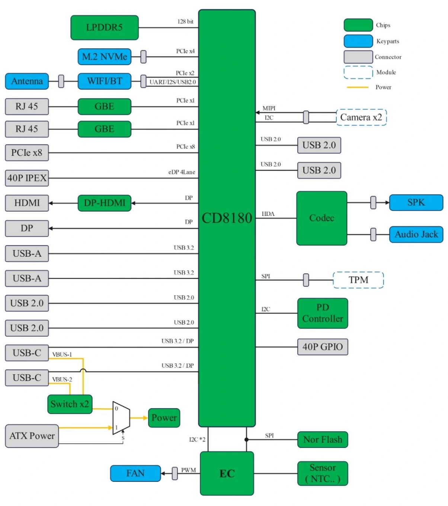

# CD8180 / P1

## General Specifications
{}

| **SoC** | **CD8180 / P1**                                                                                                                  |
|---------|----------------------------------------------------------------------------------------------------------------------------------|
| **CPU** | 4x Cortex®-A720 (Big cores) up to 2.8GHz 4x Cortex®‑A720 (Medium cores) up to 2.4GHz 4x Cortex®‑A520 (LITTLE cores) 1.8GHz |
| **RAM** | LPDDR5 RAM - 128bit memory bus - 5500MT/s transfer speed - Configurations: 4GB / 8GB / 16GB / 32GB / 64GB               |
| **GPU** | Arm® Immortalis™ G720 MC10 - Hardware Ray‑Tracing enabled - Vulkan® 1.3 - OpenGL® ES 3.2 - OpenCL® 3.0               |
| **VPU** | - 8K@60fps decoder AV1, H.265, H.264, VP9, VP8, H.263, MPEG‑4, MPEG‑2 - 8K@30fps encoder H.265, H.264, VP9, VP8               |
| **NPU** | Neural Processing Unit (NPU) - Computing Power: 30 TOPs - Precision Support: INT4 / INT8 / INT16 / FP16 / TF32             |

{}
 
{}

{}

---

## Linux Support

### Mainline kernel
- [ ] Fully supported
- [x] Works but not all features are implemented.

See [Mailing list](http://lore.kernel.org/lkml/?q=Cix+P1)
See [Community support status tracker](https://github.com/System64fumo/linux/blob/main/hardware/orion-o6.md)

---

## Boards with CD8180 / P1

List of boards:

